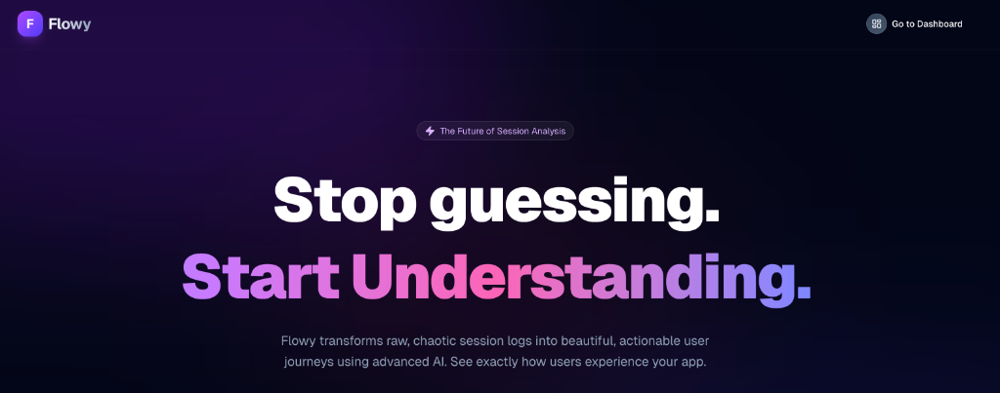

# Flowy - AI-Powered User Session Analysis



**Flowy** is a next-generation analytics platform that "sees" what your users see. It combines a lightweight iOS SDK with a powerful Web Dashboard to reconstruct user journeys using **Computer Vision**, **DOM Analysis**, and **Generative AI**.


## ✨ Key Features

-   **👁️ Hybrid Analysis Engine**: Combines OCR (Vision) with View Hierarchy (DOM) to understand *exactly* what button was tapped, even in complex custom UIs.
-   **🧠 AI-Powered Insights**: Uses Gemini 1.5 Flash to generate forensic reports, flagging "Rage Taps", "Confusion", and "Critical Errors" automatically.
-   **🚇 Metro Map Visualization**: Visualizes the user journey as a clean subway map, highlighting Success (Green) vs. Error (Red) paths.
-   **🔒 Privacy First**: All processing starts on-device. Sensitive fields (passwords) are strictly redacted before they leave the phone.


---

## 🔮 The Future of Analytics: AI-Powered Insights

The session files generated by the SDK are designed to be ingested by the **Flowy Platform** (currently in development).


Unlike "classic" logs that give you stack traces or raw event streams, Flowy uses Generative AI to understand the **User Experience**:

-   **Contextual Understanding**: Flowy "sees" what the user sees. It knows if a user clicked "Pay" because they understood the price, or if they rage-tapped it because the UI froze.
-   **Intent vs. Outcome**: Standard logs show *what* happened. Flowy analyzes *why* it happened by correlating visual cues (DOM) with user actions.
-   **Automated QA**: The platform will automatically flag UX friction points, confusion loops, and critical errors without you having to manually sift through thousands of log lines.

---


## 🏗️ Architecture

The repository currently focuses on the mobile data capture engine:

| Component | Path | Description |
| :--- | :--- | :--- |
| **iOS SDK** | [`/ios-sdk`](./ios-sdk) | The data capture engine. Uses **Apple Vision Framework** and **DOM Swizzling** to log user interactions, screens, and errors efficiently and privately. |

---

## 🚀 Getting Started

### 1. Installation
Add `FlowySDK` to your project via Swift Package Manager:
1. In Xcode, go to **File > Add Package Dependencies...**
2. Enter the repository URL: `https://github.com/taiodoio/Flowy-SDK`
3. Select **Add Package**.

### 2. Initialization
Initialize the SDK in your `AppDelegate` or `App` entry point. This starts the passive data capture engine.

```swift
import FlowySDK

@main
struct YourApp: App {
    init() {
        // Start capturing sessions
        Flowy.configure(apiKey: "YOUR_API_KEY") 
    }
    
    var body: some Scene { ... }
}
```

### 3. Data Output
Flowy automatically captures user interactions, screen hierarchies, and potential errors. These are saved as a structured JSON session file (`flowy_session.json`) on the device.

---

## 🤝 Contributing

1.  Fork the repo.
2.  Create a feature branch.
3.  Submit a Pull Request.

---

*Built with ❤️ by Flavio Montagner*
