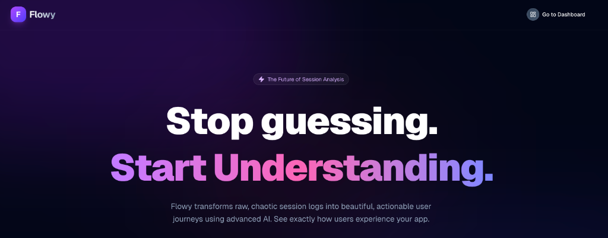

# Flowy

Flowy è una piattaforma per analizzare sessioni utente mobile senza aggiungere tag manuali a ogni interazione. Gli SDK catturano eventi, testo riconosciuto, gerarchie visuali e screenshot compressi; il dashboard ricostruisce il percorso dell’utente e mette in evidenza tap, errori, schermate e punti di attrito.

Il progetto è composto da:

- **FlowySDK iOS** — SDK completo per UIKit e SwiftUI, con export locale di un bundle di sessione JSON.
- **Flowy SDK Android** — SDK in Kotlin per cattura automatica di lifecycle, gerarchia UI e OCR; invia gli eventi all’endpoint configurato.
- **Flowy Web Dashboard** — dashboard Next.js per caricare sessioni, riprodurle, visualizzare heatmap e generare report AI.

> Stato: iOS e dashboard coprono il workflow principale export → upload → analisi. Android è attualmente sperimentale e usa una pipeline di upload separata dal bundle JSON iOS.

## Capacità

### Cattura ibrida

- OCR on-device: Apple Vision su iOS e Google ML Kit Text Recognition su Android.
- Cattura automatica delle schermate e deduplicazione visuale delle schermate passive.
- Estrazione selettiva della gerarchia UI/DOM su tap, scroll, errori e conferme di successo.
- Identificazione dei campi sensibili: i tap su campi password/secure vengono registrati senza testo.
- API manuali per registrare schermate, errori e wireframe.

### Analisi e dashboard

- Upload drag-and-drop di flowy_session_*.json.
- Replay evento per evento con associazione temporale allo screenshot più pertinente.
- Heatmap dei tap con scala assoluta: verde 1–3, giallo 4–6, arancio 7–8, rosso 9+.
- Flow graph e ricostruzione narrativa del percorso utente.
- Report multimodale Gemini: percorso, errori/successi, euristiche UX e YAML per Maestro.
- Analisi locale con Ollama e gemma4:e4b, senza API key Gemini.
- Storage locale in web/data/sessions/; non è presente un database hosted.

### Matching degli screenshot

1. TAP e SCROLL: preferisce uno screenshot fino a 5 secondi dopo l’evento.
2. SCREEN, ERROR e SUCCESS: preferisce uno screenshot fino a 10 secondi prima.
3. Fallback sul wireframe temporalmente più vicino e infine sul nome schermata fuzzy.

## Architettura

~~~text
App iOS ── exportSession() ──> flowy_session_*.json ──┐
                                                       ├─> Flowy Web Dashboard
App Android ── upload HTTPS ──> endpoint configurato ──┘       │
                                                               ├─> Replay / heatmap
                                                               ├─> Gemini remoto
                                                               └─> Ollama locale
~~~

| Componente | Directory | Requisiti principali |
|---|---|---|
| iOS SDK | [ios-sdk](./ios-sdk) | iOS 13+, Swift 5.9+, Xcode 15+ |
| Android SDK | [android-sdk](./android-sdk) | minSdk 24, compileSdk 34, Java/Kotlin target 17 |
| Web Dashboard | [web](./web) | Node.js, npm, Next.js 16 |

## Integrazione nell’app iOS

### Installazione e configurazione

In Xcode: **File → Add Package Dependencies…**, inserisci l’URL del repository e seleziona FlowySDK. Per un checkout locale usa **Add Local…** e scegli ios-sdk.

Chiama Flowy.configure prima che venga presentata la prima schermata.

SwiftUI:

~~~swift
import SwiftUI
import FlowySDK

@main
struct ExampleApp: App {
    init() {
        Flowy.configure(apiKey: "YOUR_FLOWY_API_KEY")
    }

    var body: some Scene {
        WindowGroup { ContentView() }
    }
}
~~~

UIKit:

~~~swift
import UIKit
import FlowySDK

@main
final class AppDelegate: UIResponder, UIApplicationDelegate {
    func application(
        _ application: UIApplication,
        didFinishLaunchingWithOptions options: [UIApplication.LaunchOptionsKey: Any]? = nil
    ) -> Bool {
        Flowy.configure(apiKey: "YOUR_FLOWY_API_KEY")
        return true
    }
}
~~~

Dopo configure, la cattura parte automaticamente: non servono tag o callback per tap, scroll, schermate, errori e conferme di successo.

### API manuali

~~~swift
Flowy.shared.trackScreen(name: "CheckoutWebView")
Flowy.shared.trackError(description: "Payment Gateway Timeout")

Flowy.shared.captureWireframe(screenName: "OnboardingStep2")

Flowy.shared.captureWireframe(
    screenName: "OnboardingStep2",
    screenshotBase64: screenshotBase64
)
~~~

### Export della sessione

~~~swift
Flowy.shared.exportSession()
~~~

Crea il file locale Documents/flowy_session_<timestamp>.json, con eventi, wireframe, timestamp e screenshot base64.

Per conservare anche i file parziali:

~~~swift
Flowy.shared.exportSession(deleteWireframeParts: false)
~~~

### Permessi iOS

Flowy non richiede permessi runtime per fotocamera, microfono, posizione, contatti o libreria foto. L’OCR e la cattura degli screenshot operano sulla UI dell’app e non aprono la fotocamera.

Per rendere il bundle visibile nell’app Files, aggiungi al Info.plist dell’app host, non all’SDK:

~~~xml
<key>UIFileSharingEnabled</key>
<true/>
<key>LSSupportsOpeningDocumentsInPlace</key>
<true/>
~~~

Queste chiavi sono opzionali: in alternativa recupera il bundle da Xcode tramite **Window → Devices and Simulators → Download Container…**.

### Privacy iOS

- L’OCR viene eseguito on-device tramite Apple Vision.
- I campi secure vengono registrati come [SECURE_FIELD] senza testo.
- Screenshot, eventi e gerarchie restano localmente nell’app fino all’export manuale.
- La gerarchia può contenere testo visibile non classificato come secure: valida i flussi reali prima della distribuzione.
- Una API key mobile può essere estratta: usa chiavi limitate all’ambiente e ai permessi necessari.

Guida completa: [ios-sdk/README.md](./ios-sdk/README.md) e [ios-sdk/GUIDA_INTEGRAZIONE.md](./ios-sdk/GUIDA_INTEGRAZIONE.md).

## Integrazione nell’app Android

L’SDK è un modulo library Kotlin. Includilo nel progetto:

~~~kotlin
// settings.gradle.kts
include(":app", ":flowy-sdk")
project(":flowy-sdk").projectDir = file("../Flowy-SDK/android-sdk")
~~~

~~~kotlin
// app/build.gradle.kts
dependencies {
    implementation(project(":flowy-sdk"))
}
~~~

Configuralo nella classe Application:

~~~kotlin
import android.app.Application
import com.flowy.sdk.Flowy
import com.flowy.sdk.FlowyOptions

class ExampleApplication : Application() {
    override fun onCreate() {
        super.onCreate()

        Flowy.configure(
            application = this,
            apiKey = "YOUR_FLOWY_API_KEY",
            options = FlowyOptions(
                uploadUrl = "https://your-backend.example.com/flowy/events"
            )
        )
    }
}
~~~

Registra la classe nel manifest dell’app:

~~~xml
<application
    android:name=".ExampleApplication"
    ... />
~~~

### Permessi Android

Il modulo dichiara già:

~~~xml
<uses-permission android:name="android.permission.INTERNET" />
<uses-permission android:name="android.permission.ACCESS_NETWORK_STATE" />
~~~

Non sono richiesti permessi runtime per fotocamera, microfono, posizione, storage o accessibilità. L’SDK usa i lifecycle callback e l’intercettazione delle finestre dell’app stessa.

Gli eventi vengono inviati all’uploadUrl tramite HTTPS con header Authorization: Bearer apiKey. Il backend deve autenticare la richiesta e gestire il payload JSON. Il valore predefinito nel modulo è https://api.flowy.com/v1/events; per un’installazione reale configura esplicitamente un endpoint controllato dal tuo ambiente.

> Limitazione attuale: Android non espone ancora l’equivalente iOS di exportSession() per creare un bundle completo importabile nel dashboard. La pipeline corrente invia gli eventi tramite FlowyUploader.

## Esecuzione del Web Dashboard

~~~bash
cd web
npm install
npm run dev
~~~

Apri [http://localhost:3000](http://localhost:3000) e carica un flowy_session_*.json esportato dall’SDK iOS.

Build di produzione:

~~~bash
npm run build
npm start
~~~

### Gemini remoto

Crea localmente web/.env.local:

~~~dotenv
GEMINI_API_KEY=replace_with_your_key
~~~

La chiave viene letta dalle API server-side. Non usare NEXT_PUBLIC_GEMINI_API_KEY e non inserirla nel codice client. .env.local è ignorato da Git e non deve essere committato.

### Ollama locale

~~~bash
ollama pull gemma4:e4b
ollama serve
~~~

Il dashboard usa Ollama su http://localhost:11434. Questa modalità non richiede GEMINI_API_KEY, ma il processo Next.js deve poter raggiungere Ollama.

### Storage e sicurezza

- Le sessioni caricate vengono salvate in web/data/sessions/.
- Lo storage è locale e pensato per sviluppo o installazioni controllate.
- Proteggi il server e gli endpoint prima di esporre il dashboard su una rete pubblica.
- Non committare .env.local, API key, sessioni reali o payload con dati personali.

## Formato del session bundle

L’export iOS usa un file JSON consolidato:

~~~json
{
  "version": 1,
  "exported_at": 1711234567.89,
  "events": [
    {
      "action": "TAP",
      "ocr_text": "Add to Cart [UIButton]",
      "coordinates": { "x": 195.0, "y": 720.0 },
      "screen_name": "Product Detail",
      "timestamp": 1711234567.89
    }
  ],
  "wireframes": [
    {
      "screen_name": "dashboard_3",
      "captured_at": 1711234568.12,
      "tree": { "class_name": "Button", "frame": { "x": 16, "y": 740, "width": 358, "height": 50 }, "text": "Continue", "children": null },
      "screenshot_base64": "<base64 JPEG>"
    }
  ]
}
~~~

| Evento | Significato |
|---|---|
| SCREEN | Una schermata è diventata visibile. |
| TAP | Tap con testo riconosciuto tramite OCR. |
| SECURE_TAP | Tap su un campo secure; il testo non viene registrato. |
| SCROLL | Scroll oltre 12 pt; viene catturato lo stato successivo. |
| ERROR | Testo associato a un errore rilevato. |
| SUCCESS | Testo di conferma o successo rilevato. |

## Configurazione della cattura

I valori di timing e qualità sono documentati in [ios-sdk/TUNING.md](./ios-sdk/TUNING.md).

| Parametro | Valore |
|---|---:|
| Ritardo cattura dopo tap | 0,8 s |
| Ritardo cattura dopo scroll | 0,5 s |
| Ritardo cattura schermata passiva | 0,3 s |
| Debounce scansione passiva | 0,9 s |
| Scala screenshot normale | 0,40 |
| Qualità JPEG normale | 0,40 |
| Soglia deduplicazione visuale | 8% |

## Troubleshooting

**Il dashboard mostra solo lo splash screen** — chiama Flowy.configure prima del primo viewDidAppear.

**Lo screenshot associato all’evento è errato** — carica il bundle completo esportato da exportSession(), inclusi captured_at, wireframes e screenshot_base64.

**No key window found su iOS** — chiama captureWireframe in viewDidAppear o onAppear.

**Il file non è visibile nell’app Files** — aggiungi UIFileSharingEnabled e LSSupportsOpeningDocumentsInPlace all’Info.plist dell’app host.

**Gemini non parte** — verifica GEMINI_API_KEY in web/.env.local, poi riavvia Next.js.

**Ollama non parte** — verifica ollama serve, il modello gemma4:e4b e http://localhost:11434.

**Android non invia eventi** — controlla INTERNET, uploadUrl, raggiungibilità HTTPS e risposta server. L’header è Authorization: Bearer apiKey.

## Sviluppo e verifica

~~~bash
cd web
npm run lint
npm run build
~~~

Per i test iOS:

~~~bash
cd ios-sdk
swift test
~~~

Il modulo Android richiede Gradle/Android Studio con SDK Android 34 e Java 17.

## Struttura del repository

~~~text
Flowy-SDK/
├── ios-sdk/       # Swift Package Manager + test iOS
├── android-sdk/   # Android library Kotlin
├── web/           # Next.js dashboard e API server-side
├── assets/        # Immagini della documentazione/UI
└── README.md
~~~

## Contribuire

1. Crea un branch dedicato.
2. Non aggiungere .env*, API key, sessioni reali, .gradle/, .npm-cache/ o file generati.
3. Esegui i check del componente modificato.
4. Apri una pull request descrivendo cambiamenti, limiti e impatto privacy.

## Licenza

Il repository non contiene attualmente un file LICENSE. Verifica i termini di utilizzo con i maintainer prima di distribuire Flowy o incorporarlo in un prodotto.

*Built with ❤️ by Flavio Montagner*
