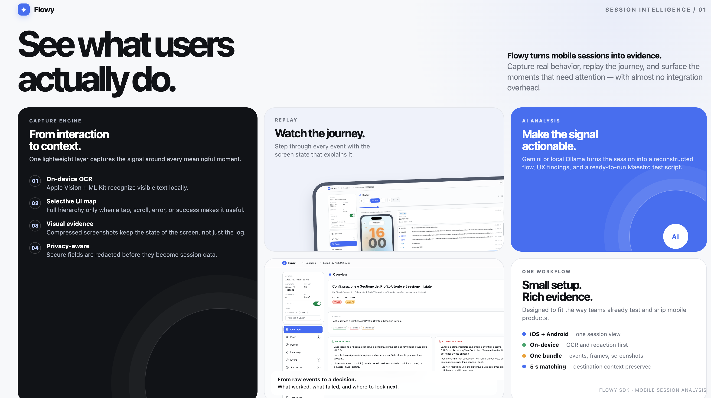
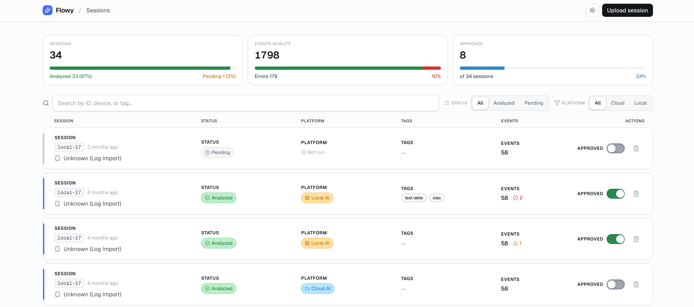
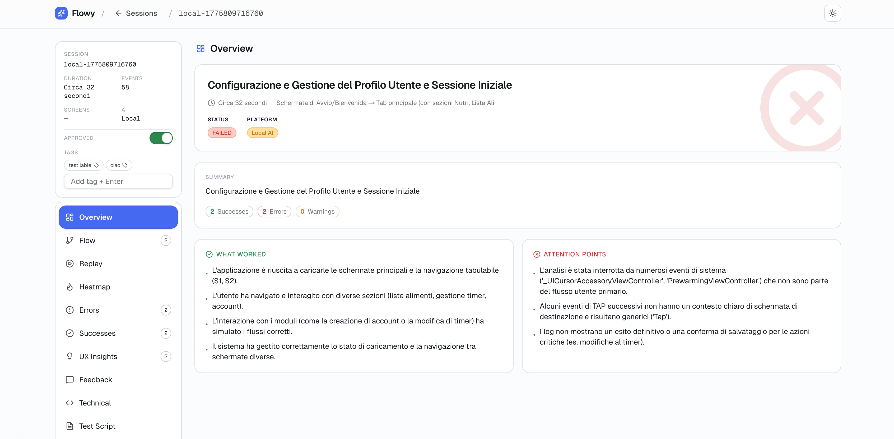
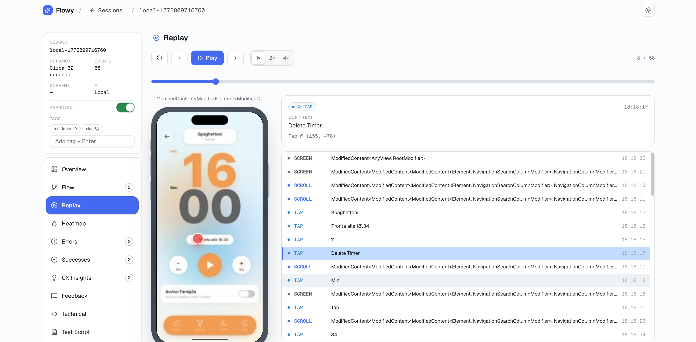

# Flowy

Flowy is a platform for analyzing mobile user sessions without adding manual tags to every interaction. Its SDKs capture events, recognized text, visual hierarchies, and compressed screenshots; the dashboard reconstructs the user journey and highlights taps, errors, screens, and friction points.

The project is composed of:

- **FlowySDK for iOS** — Full SDK for UIKit and SwiftUI, with local export of a JSON session bundle.
- **Flowy SDK for Android** — Kotlin SDK for automatic lifecycle, UI hierarchy, and OCR capture; sends events to a configured endpoint.
- **Flowy Web Dashboard** — Next.js dashboard for uploading and replaying sessions, viewing heatmaps, and generating AI reports.

> Status: iOS and the dashboard cover the main export → upload → analysis workflow. Android is currently experimental and uses an upload pipeline separate from the iOS JSON bundle.

## Capabilities

### Hybrid capture

- On-device OCR: Apple Vision on iOS and Google ML Kit Text Recognition on Android.
- Automatic screen capture and visual deduplication of passive screen states.
- Selective UI/DOM hierarchy extraction on taps, scrolls, errors, and success confirmations.
- Sensitive-field detection: taps on password/secure fields are recorded without capturing their text.
- Manual APIs for recording screens, errors, and wireframes.

### Analysis and dashboard

- Drag-and-drop upload of flowy_session_*.json files.
- Event-by-event replay with timestamp-based screenshot matching.
- Tap heatmaps with an absolute scale: green 1–3, yellow 4–6, orange 7–8, red 9+.
- Flow graph and narrative reconstruction of the user journey.
- Multimodal Gemini reports covering the journey, errors/successes, UX heuristics, and Maestro YAML.
- Local analysis with Ollama and gemma4:e4b, without a Gemini API key.
- Local storage in web/data/sessions/; there is currently no hosted database.

### Screenshot matching

1. TAP and SCROLL events prefer a screenshot captured up to 5 seconds after the event.
2. SCREEN, ERROR, and SUCCESS events prefer a screenshot captured up to 10 seconds before the event.
3. The fallback is the closest wireframe by timestamp, followed by fuzzy screen-name matching.

## Architecture

~~~text
iOS app ── exportSession() ──> flowy_session_*.json ──┐
                                                       ├─> Flowy Web Dashboard
Android app ── HTTPS upload ──> configured endpoint ────┘       │
                                                               ├─> Replay / heatmap
                                                               ├─> Remote Gemini
                                                               └─> Local Ollama
~~~

| Component | Directory | Main requirements |
|---|---|---|
| iOS SDK | [ios-sdk](./ios-sdk) | iOS 13+, Swift 5.9+, Xcode 15+ |
| Android SDK | [android-sdk](./android-sdk) | minSdk 24, compileSdk 34, Java/Kotlin target 17 |
| Web Dashboard | [web](./web) | Node.js, npm, Next.js 16 |

## Dashboard preview

The Sessions view collects imported sessions, analysis status, AI platform, tags, and event counts.

The Overview view summarizes the session result and separates what worked from the attention points found during analysis.

The Replay view lets you follow events over time, inspect the associated screenshot, and analyze taps and scrolls.

## Integrating the iOS SDK

### Installation and configuration

In Xcode, choose **File → Add Package Dependencies…**, enter the repository URL, and select FlowySDK. For a local checkout, choose **Add Local…** and select ios-sdk.

Call Flowy.configure before the first screen is presented.

SwiftUI:

~~~swift
import SwiftUI
import FlowySDK

@main
struct ExampleApp: App {
    init() {
        Flowy.configure(apiKey: "YOUR_FLOWY_API_KEY")
    }

    var body: some Scene {
        WindowGroup { ContentView() }
    }
}
~~~

UIKit:

~~~swift
import UIKit
import FlowySDK

@main
final class AppDelegate: UIResponder, UIApplicationDelegate {
    func application(
        _ application: UIApplication,
        didFinishLaunchingWithOptions options: [UIApplication.LaunchOptionsKey: Any]? = nil
    ) -> Bool {
        Flowy.configure(apiKey: "YOUR_FLOWY_API_KEY")
        return true
    }
}
~~~

After configure, capture starts automatically. No manual tags or callbacks are required for taps, scrolls, screens, errors, or success confirmations.

### Manual APIs

~~~swift
Flowy.shared.trackScreen(name: "CheckoutWebView")
Flowy.shared.trackError(description: "Payment Gateway Timeout")

Flowy.shared.captureWireframe(screenName: "OnboardingStep2")

Flowy.shared.captureWireframe(
    screenName: "OnboardingStep2",
    screenshotBase64: screenshotBase64
)
~~~

### Exporting a session

~~~swift
Flowy.shared.exportSession()
~~~

This creates Documents/flowy_session_<timestamp>.json with events, wireframes, timestamps, and base64 screenshots.

To keep the individual partial files after merging:

~~~swift
Flowy.shared.exportSession(deleteWireframeParts: false)
~~~

### iOS permissions

Flowy does not require runtime permissions for the camera, microphone, location, contacts, or photo library. OCR and screenshot capture operate on the app UI and do not open the camera.

To make the bundle visible in the **Files** app, add these keys to the host app's Info.plist, not to the SDK:

~~~xml
<key>UIFileSharingEnabled</key>
<true/>
<key>LSSupportsOpeningDocumentsInPlace</key>
<true/>
~~~

These keys are optional. Alternatively, retrieve the bundle from Xcode through **Window → Devices and Simulators → Download Container…**.

### iOS privacy

- OCR runs on-device through Apple Vision.
- Secure fields are recorded as [SECURE_FIELD] without their text.
- Screenshots, events, and hierarchies remain local until you manually export the session.
- The hierarchy may contain visible text that is not classified as secure; validate real flows before distribution.
- A mobile API key can be extracted: use keys restricted to the relevant environment and permissions.

Full guides: [ios-sdk/README.md](./ios-sdk/README.md) and [ios-sdk/GUIDA_INTEGRAZIONE.md](./ios-sdk/GUIDA_INTEGRAZIONE.md).

## Integrating the Android SDK

The SDK is a Kotlin library module. Include it in your project:

~~~kotlin
// settings.gradle.kts
include(":app", ":flowy-sdk")
project(":flowy-sdk").projectDir = file("../Flowy-SDK/android-sdk")
~~~

~~~kotlin
// app/build.gradle.kts
dependencies {
    implementation(project(":flowy-sdk"))
}
~~~

Configure it in the Application class:

~~~kotlin
import android.app.Application
import com.flowy.sdk.Flowy
import com.flowy.sdk.FlowyOptions

class ExampleApplication : Application() {
    override fun onCreate() {
        super.onCreate()

        Flowy.configure(
            application = this,
            apiKey = "YOUR_FLOWY_API_KEY",
            options = FlowyOptions(
                uploadUrl = "https://your-backend.example.com/flowy/events"
            )
        )
    }
}
~~~

Register the class in the app manifest:

~~~xml
<application
    android:name=".ExampleApplication"
    ... />
~~~

### Android permissions

The module already declares:

~~~xml
<uses-permission android:name="android.permission.INTERNET" />
<uses-permission android:name="android.permission.ACCESS_NETWORK_STATE" />
~~~

No runtime permissions are required for the camera, microphone, location, storage, or accessibility. The SDK uses the app's lifecycle callbacks and intercepts windows belonging to the app itself.

Events are sent to uploadUrl over HTTPS with an Authorization: Bearer apiKey header. The backend must authenticate the request and handle the JSON payload. The module default is https://api.flowy.com/v1/events; for a real installation, explicitly configure an endpoint controlled by your environment.

> Current limitation: Android does not yet expose the iOS equivalent of exportSession() for creating a complete bundle importable into the dashboard. The current pipeline sends events through FlowyUploader.

## Running the Web Dashboard

~~~bash
cd web
npm install
npm run dev
~~~

Open [http://localhost:3000](http://localhost:3000) and upload a flowy_session_*.json file exported by the iOS SDK.

Production build:

~~~bash
npm run build
npm start
~~~

### Remote Gemini analysis

Create web/.env.local locally:

~~~dotenv
GEMINI_API_KEY=replace_with_your_key
~~~

The key is read by server-side APIs. Do not use NEXT_PUBLIC_GEMINI_API_KEY or place the key in client code. .env.local is ignored by Git and must never be committed.

### Local Ollama analysis

~~~bash
ollama pull gemma4:e4b
ollama serve
~~~

The dashboard uses Ollama at http://localhost:11434. This mode does not require GEMINI_API_KEY, but the Next.js process must be able to reach Ollama.

### Storage and security

- Uploaded sessions are stored in web/data/sessions/.
- Storage is local and intended for development or controlled installations.
- Protect the server and upload endpoints before exposing the dashboard on a public network.
- Never commit .env.local, API keys, real sessions, or payloads containing personal data.

## Session bundle format

The iOS export uses a consolidated JSON file:

~~~json
{
  "version": 1,
  "exported_at": 1711234567.89,
  "events": [
    {
      "action": "TAP",
      "ocr_text": "Add to Cart [UIButton]",
      "coordinates": { "x": 195.0, "y": 720.0 },
      "screen_name": "Product Detail",
      "timestamp": 1711234567.89
    }
  ],
  "wireframes": [
    {
      "screen_name": "dashboard_3",
      "captured_at": 1711234568.12,
      "tree": { "class_name": "Button", "frame": { "x": 16, "y": 740, "width": 358, "height": 50 }, "text": "Continue", "children": null },
      "screenshot_base64": "<base64 JPEG>"
    }
  ]
}
~~~

| Event | Meaning |
|---|---|
| SCREEN | A screen became visible. |
| TAP | A tap with OCR-recognized text. |
| SECURE_TAP | A tap on a secure field; text is not recorded. |
| SCROLL | A scroll beyond 12 pt; the following state is captured. |
| ERROR | Error-related text was detected. |
| SUCCESS | Confirmation or success text was detected. |

## Capture configuration

Timing and quality values are documented in [ios-sdk/TUNING.md](./ios-sdk/TUNING.md).

| Parameter | Value |
|---|---:|
| Capture delay after tap | 0.8 s |
| Capture delay after scroll | 0.5 s |
| Passive screen capture delay | 0.3 s |
| Passive scan debounce | 0.9 s |
| Normal screenshot scale | 0.40 |
| Normal JPEG quality | 0.40 |
| Visual deduplication threshold | 8% |

## Troubleshooting

**The dashboard only shows the splash screen** — call Flowy.configure before the first viewDidAppear.

**The matched screenshot is wrong** — upload the complete bundle exported by exportSession(), including captured_at, wireframes, and screenshot_base64.

**No key window found on iOS** — call captureWireframe in viewDidAppear or onAppear.

**The file is not visible in the Files app** — add UIFileSharingEnabled and LSSupportsOpeningDocumentsInPlace to the host app's Info.plist.

**Gemini analysis does not start** — verify GEMINI_API_KEY in web/.env.local, then restart Next.js.

**Ollama analysis does not start** — verify ollama serve, the gemma4:e4b model, and http://localhost:11434.

**Android does not send events** — check INTERNET, uploadUrl, HTTPS reachability, and the server response. The header is Authorization: Bearer apiKey.

## Development and verification

~~~bash
cd web
npm run lint
npm run build
~~~

For iOS tests:

~~~bash
cd ios-sdk
swift test
~~~

The Android module requires Gradle/Android Studio with Android SDK 34 and Java 17.

## Repository structure

~~~text
Flowy-SDK/
├── ios-sdk/       # Swift Package Manager + iOS tests
├── android-sdk/   # Kotlin Android library
├── web/           # Next.js dashboard and server-side APIs
├── assets/        # Documentation/UI images
└── README.md
~~~

## Contributing

1. Create a dedicated branch.
2. Do not add .env*, API keys, real sessions, .gradle/, .npm-cache/, or generated files.
3. Run the checks for the component you changed.
4. Open a pull request describing changes, limitations, and privacy impact.

## License

The repository currently does not contain a LICENSE file. Confirm the terms of use with the maintainers before distributing Flowy or embedding it in a product.

*Built with ❤️ by Flavio Montagner*
